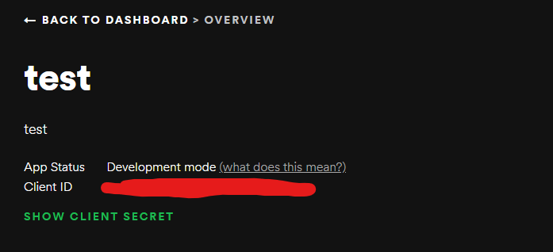

# SMT project: Music recommendation and analysis <!-- omit in toc -->
- [General information](#general-information)
  - [Abstract](#abstract)
  - [The Spotify Web API](#the-spotify-web-api)
  - [Spotipy](#spotipy)
  - [Citation](#citation)
- [Setup](#setup)
  - [Register Your Application With Spotify](#register-your-application-with-spotify)
  - [Install Dependencies](#install-dependencies)
- [Running](#running)
  - [Example Run](#example-run)

This repository contains the code for the Sound and Music Technology Project in 2021 for group 2. The title of the corresponding paper is as follows: Computational analysis of audio feature information and their impact on emotion regulation.


## General information

The program output includes LaTeX tables with descriptive statistics and Bonferroni corrected t-tests, as well as the actual track recommendations based on the descriptive statistical values of extracted audio features. The spotify API is used in this project.

### Abstract
Emotional self-regulation is acknowledged as one of the most important reasons for musical engagement at all ages. Several studies proved the importance of music in emotion regulation. The aim of this study is to further investigate the audio features of songs that could be used for promoting positive mood and to build a content-based recommender system that produces a list of song recommendations based on the most important features of songs that promote a positive mood. The features with most importance are valence, danceability, energy, loudness, speechiness and tempo which is expected and in line with previous work done in the field and extends the valence-arousal model by Russell with other features that could serve for mood classification. 

### Citation

Use this citation for citing the implementation.
```
@software{Polancec_Computational_analysis_of_2022,
author = {Polancec, Ana and Stolk, Annemik and Hendriks, Geertje and Quach, Keven and Gerritse, Maarten and Ebbertz, Morice},
month = {1},
title = {{Computational analysis of audio feature information and their impact on emotion regulation}},
url = {https://github.com/mebbertz/infomsmt-computational-analysis},
version = {1.0.0},
year = {2022}
}
```

## Setup

### Register Your Application With Spotify

In order to access certain features of the Web API, we need to tell spotify that we're a legitimate app.
To do this, go to https://developer.spotify.com/my-applications and create a new Application.

From that page, copy your ClientId and your ClientSecret and put them into a file called
`.env` in the root of this repo that looks like this:
```
SPOTIPY_CLIENT_ID='YOUR_CLIENT_ID'
SPOTIPY_CLIENT_SECRET='YOUR_CLIENT_SECRET'
```
Here is an example screenshot of how this looks like:

For details about how the API authenticates your account with this, see
https://developer.spotify.com/web-api/authorization-guide/#authorization_code_flow

### Install Dependencies

In order to run this program, we need to make sure python3 and pip are installed on your system.
To install this stuff, run

```bash
pip install -r requirements.txt
```

## Running

To run the project, navigate to the src folder and execute the following from the command line. Assuming you opened a terminal in the root folder, follow these commands (on Windows):

```bash
cd src
python main.py
```

You need to provide a playlists.csv file in the root directory. See following example:

```
playlist_name,link,category
Mood Booster,https://open.spotify.com/playlist/37i9dQZF1DX3rxVfibe1L0,mood boosting
Songs to Sing in the Shower,https://open.spotify.com/playlist/37i9dQZF1DWSqmBTGDYngZ,mood boosting
Happy Hits!,https://open.spotify.com/playlist/37i9dQZF1DXdPec7aLTmlC,mood boosting
Feelin' Good,https://open.spotify.com/playlist/37i9dQZF1DX9XIFQuFvzM4,mood boosting
Positive Vibes,https://open.spotify.com/playlist/37i9dQZF1DWUAZoWydCivZ,mood boosting
Running Wild,https://open.spotify.com/playlist/37i9dQZF1DX35oM5SPECmN,running
Fun Run,https://open.spotify.com/playlist/37i9dQZF1DXadOVCgGhS7j,running
Running Music Hits,https://open.spotify.com/playlist/0JTaSx9jkW1saMOc6t0vIk,running
Run This Town,https://open.spotify.com/playlist/37i9dQZF1DWWPcvnOpPG3x,running
Retro Running,https://open.spotify.com/playlist/37i9dQZF1DX4osfY3zybD2,running
Running UK,https://open.spotify.com/playlist/37i9dQZF1DWZ2xRu8ajLOe,running
Pop Rock Run,https://open.spotify.com/playlist/37i9dQZF1DWV3VLITCZusq,running
Deep Focus,https://open.spotify.com/playlist/37i9dQZF1DWZeKCadgRdKQ,studying
Instense Studying,https://open.spotify.com/playlist/37i9dQZF1DX8NTLI2TtZa6,studying
All-Nighter,https://open.spotify.com/playlist/37i9dQZF1DX692WcMwL2yW,studying
```

Only link and category are needed. You can leave the playlist_name empty. The program assumes that there are 3 playlist categories provided:
mood boosting, running, studying
At least one playlist in each category is necessary for the program to work. Mood boosting is the category which the recommendations will be based upon.

It is also possible to use other .csv or .xlsx files. Here is an example. You need to specify the file name on the command line:

```bash
python main.py --input ../other_file_name.csv
```

### Example Run

```
**************************************************
Spotify Web API - Computational Analysis
**************************************************

**************************************************
Parsing playlists
**************************************************
Get tracks from list of playlists for mood boosting
Total number of tracks retrieved: 495
Get tracks from list of playlists for running
Total number of tracks retrieved: 502
Get tracks from list of playlists for studying
Total number of tracks retrieved: 505

**************************************************
Calculating statistics
**************************************************
Successfully calculated statistics and exported to tables subfolder.

**************************************************
Get top 5 genres
**************************************************
Total number of artists retrieved: 662
Unique number of artists retrieved: 363
Found 5 genres: pop, soul, edm, funk, disco

**************************************************
Get recommendations
**************************************************
Artists: Duke Dumont; Jax Jones
Name: I Got U
Preview-URL: None
Spotify-URL: https://open.spotify.com/track/4r8hRPbidDIoDPphxi78aY

Artists: Jess Glynne
Name: All I Am
Preview-URL: None
Spotify-URL: https://open.spotify.com/track/5GNjiM8jZCgbqjHklAcT9e

Artists: Thelma Houston
Name: Don't Leave Me This Way - Single Version
Preview-URL: None
Spotify-URL: https://open.spotify.com/track/4IMArXimMttK8tB0UBa0Ue

Artists: Britney Spears
Name: Till the World Ends
Preview-URL: https://p.scdn.co/mp3-preview/fd017ae5c0a60cff3d5f5b4d37c4e8617c93b11f?cid=33046789d13d49dda7597ce0554f1919
Spotify-URL: https://open.spotify.com/track/38iU2jg98IZZEIJPrP7aWD

Artists: Pitbull; Ne-Yo
Name: Time of Our Lives
Preview-URL: https://p.scdn.co/mp3-preview/c7ee72511ef4733508b42f92de3e62ed4753e223?cid=33046789d13d49dda7597ce0554f1919
Spotify-URL: https://open.spotify.com/track/2bJvI42r8EF3wxjOuDav4r

Artists: Flo Rida
Name: I Cry
Preview-URL: https://p.scdn.co/mp3-preview/83ecc26ad34e94df4a61ed9e44cdd3bacda81d6a?cid=33046789d13d49dda7597ce0554f1919
Spotify-URL: https://open.spotify.com/track/3zrYNl1aMdFrQkcOjKVr5u

Artists: Echosmith
Name: Cool Kids
Preview-URL: https://p.scdn.co/mp3-preview/27df0a89036135748fd03fb67114abeb00c529a4?cid=33046789d13d49dda7597ce0554f1919
Spotify-URL: https://open.spotify.com/track/13P5rwmk2EsoFRIz9UCeh9

Artists: Melanie Martinez
Name: Dollhouse
Preview-URL: https://p.scdn.co/mp3-preview/d98a9f944430689505c2ee20aa6180b6949830f0?cid=33046789d13d49dda7597ce0554f1919
Spotify-URL: https://open.spotify.com/track/6wNeKPXF0RDKyvfKfri5hf

Artists: Little Mix
Name: Touch
Preview-URL: None
Spotify-URL: https://open.spotify.com/track/6B7op3kK1kFQp4Ck1UZtK5

Artists: Martha Reeves & The Vandellas
Name: Dancing In The Street
Preview-URL: None
Spotify-URL: https://open.spotify.com/track/6TPl5DQrkBY2XIqIaFmxqi
```
